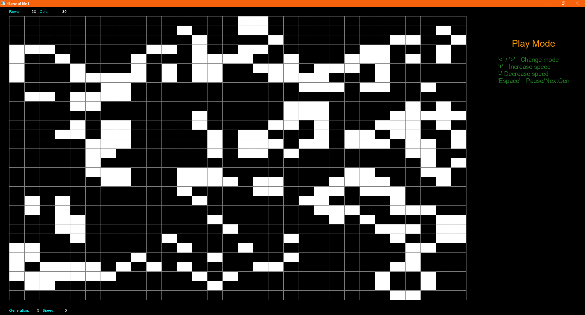

# GameOfLife - FunctionalSpecifications

This project was made for `Algebra University School`, Homework 2.

Table of Contents

- [Stickman Exploration - Functional Specifications](#stickman-exploration---functional-specifications)
  - [Project Scope](#project-scope)
  - [Functional requirements](#functional-requirements)
  - [Use Cases](#use-cases)
    - [Controls](#controls)
        - [Controls](#Edit-Mode)
        - [Controls](#Play-Mode)

  - [Appendix](#appendix)
    - [Game Screen Scheme](#game-screen-scheme)

## Project Scope

This game describe the functionment of a cellular organisme and its evolution in its envirenment.
Each cell can be eather dead or alive, the board is update each next generation. 

## Functional requirements

The Game of Life has 3 rules :
- If a cell is alive :
    - If it has 2 or 3 neighbours, then it stays alive
    - If it has 1 or more than 3 neighbours, then it dies
- If a cell is dead :
    - If it has 3 neighbours, then the cell springs to life

## Use Cases

### Controls

#### Edit mode

| action       | key2        | description                                          |
| ------------ | ----------- | ---------------------------------------------------- |
| press        | Arrow Left  | Change game mode to the prevoius one                 |
| press        | Arrow Right | Change game mode to the next one                     |
| press        | E           | Errase the actual board                              |
| press        | R           | Fill the board randomly (spawn chance : 25%)         |
| press        | Left Click  | Create a new cell on the actual square               |
| press        | Right Click | remove the cell on the actual square                 |

#### Play mode

| action       | key2        | description                                          |
| ------------ | ----------- | ---------------------------------------------------- |
| press        | Arrow Left  | Change game mode to the prevoius one                 |
| press        | Arrow Right | Change game mode to the next one                     |
| press/hold   | +           | Increase actualisation speed                         |
| press/hold   | -           | Decrease actualisation speed                         |
| press/hold   | SPACE       | Pause auto update/Update tu next generation          |

## Appendix

### Game Screen Scheme

