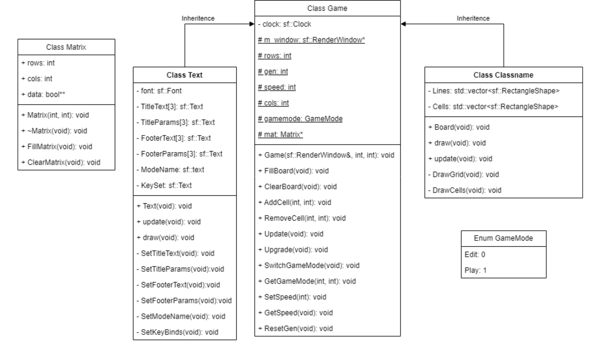

# GameOfLife - TechnicalSpecifications

Table of Contents

- [Stickman Exploration - TechnicalSpecifications](#GameOfLife---TechnicalSpecifications)
- [Overview](#overview)
    - [Purpose](#purpose)
        - [Goals](#goals)
- [Class diagram](#class-diagram)
    - [Hardware](#hardware)
    - [License](#license)

## Overview

### Purpose

#### Goals

This projects implements the Conway's game of life in c++ with SFML

## Class diagram

### Hardware

The project will be compatible with the most common hardware configurations, and will be tested on the following hardware:

| Specification    | KATANA-GF76-12UC     |
| ---------------- | -------------------- |
| Processor        | Intel Core i7-12700H |
| RAM              | 16 GB                |
| Operating System | Windows 11 Pro       |

### License

This project is licensed under the MIT License - see the [LICENSE](../LICENSE) file for details.